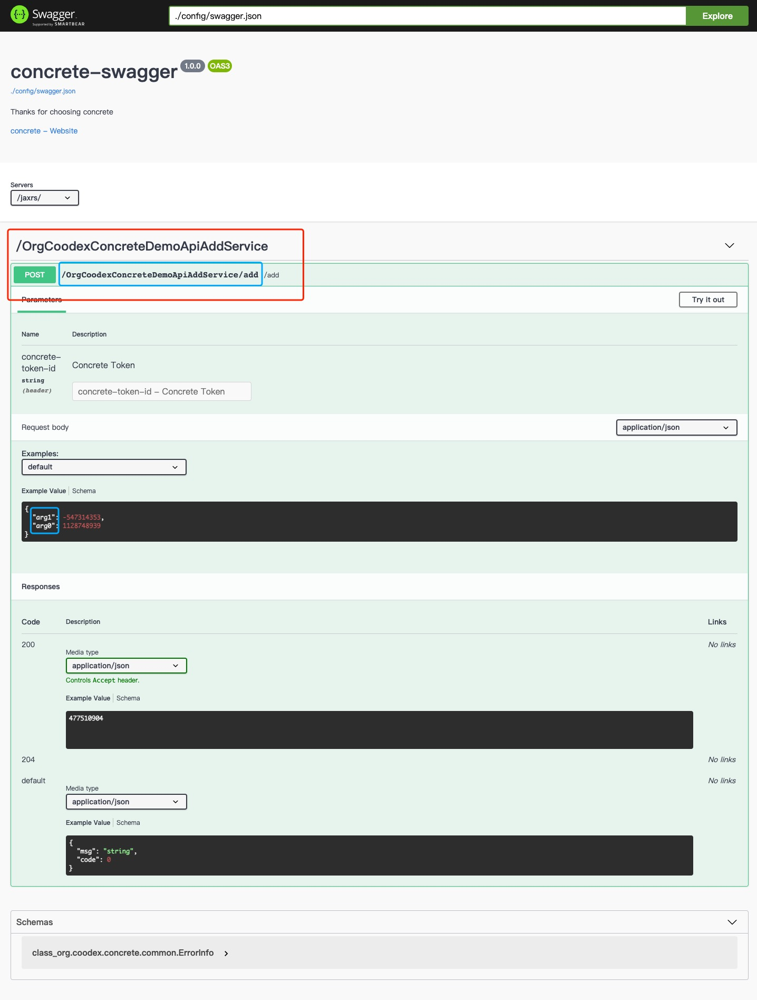

# 定义一个 Concrete 服务

## 建 demo-api 模块

先按照约定创建`demo-api`模块，引入`concrete-api`规范。

```xml
<dependencies>
    <dependency>
        <groupId>org.coodex</groupId>
        <artifactId>concrete-api</artifactId>
    </dependency>
</dependencies>
```

在这个模块下新建`interface`

```java
package org.coodex.concrete.demo.api;

import org.coodex.concrete.api.ConcreteService;

@ConcreteService
public interface AddService {
    int add(int x1, int x2);
}
```

ok, 这就是一个最基本的 concrete service 了。有什么用呢？不急，一点点看，先把实现和服务跑起来。下面先简单一过，让结构完整起来，我们再一点点了解 concrete。

## 建 demo-impl 模块

```xml

<dependencies>

    <!-- 使用javax inject规范,jsr-330 -->
    <dependency>
        <groupId>javax.inject</groupId>
        <artifactId>javax.inject</artifactId>
        <scope>provided</scope>
    </dependency>

    <!-- 依赖api，对其进行实现 -->
    <dependency>
        <!-- 对用同一个项目，项目内依赖尽量采用以下变量方式指定groupId和version -->
        <groupId>${project.parent.groupId}</groupId>
        <artifactId>demo-api</artifactId>
        <version>${project.parent.version}</version>
    </dependency>

</dependencies>

```

实现，比较简单

```java
package org.coodex.concrete.demo.impl;

import org.coodex.concrete.demo.api.AddService;

import javax.inject.Named;

@Named//inject规范
public class AddServiceImpl implements AddService {

    @Override
    public int add(int x1, int x2) {
        return x1 + x2;
    }
}
```

::: tip 实践建议
这里注意一下，我们并不是使用 spring 相关的注解，concrete 主张依赖规范而不依赖具体。
:::

## 建 demo-boot 模块

```xml
    <dependencies>
        <dependency>
            <groupId>${project.parent.groupId}</groupId>
            <artifactId>demo-impl</artifactId>
            <version>${project.parent.version}</version>
        </dependency>

        <!-- 使用javax.inject规范, spring-boot也支持 -->
        <dependency>
            <groupId>javax.inject</groupId>
            <artifactId>javax.inject</artifactId>
        </dependency>

        <!-- 使用concrete的spring boot jaxrs组件发布服务 -->
        <dependency>
            <groupId>org.coodex.concrete.jaxrs</groupId>
            <artifactId>concrete-jaxrs-spring-boot</artifactId>
        </dependency>

        <!-- swagger支持，方便查看和实验而已，非必须 -->
        <dependency>
            <groupId>org.coodex.concrete.jaxrs</groupId>
            <artifactId>concrete-jaxrs-swagger</artifactId>
        </dependency>

    </dependencies>
```

::: tip 实践建议
关于 swagger，我们建议在项目中把 concrete-jaxrs-swagger 的作用域定义为 test，然后在 test 作用域里启动服务
:::

demoBoot

```java
package org.coodex.concrete.demo.boot;

import org.coodex.concrete.spring.boot.EnableConcreteJAXRS;
import org.springframework.boot.SpringApplication;
import org.springframework.boot.autoconfigure.SpringBootApplication;

@SpringBootApplication(
        scanBasePackages = "org.coodex.concrete.demo.**.impl"
)
// 启用concrete jaxrs
@EnableConcreteJAXRS(
        servicePackages = "org.coodex.concrete.demo.**.api"
)
public class DemoBootStarter {

    public static void main(String[] args) {
        SpringApplication.run(DemoBootStarter.class, args);
    }

}
```

::: tip EnableConcreteJAXRS
EnableConcreteJAXRS 是一个基于 Spring-boot 的注解，可以用来快捷开启 concrete 的 jaxrs 功能，通常用来指定需要发布的服务包，servletMapping，一共有四个属性

- servicePackages: String[], 扫描 concreteServices 的包，默认使用[`Configuration`](https://docs.coodex.org/lib/coodex-utilities/org.coodex.util.Config.html)命名空间`concrete`/`jaxrs`/`当前appSet`下的`api.packages`，如果为空，则使用`Configuration`命名空间`concrete`/`当前appSet`下的`api.packages`
- classes: Class&lt;?>[], 额外需要注册的类，默认使用`Configuration`命名空间`concrete`/`jaxrs`/`当前appSet`下的`jaxrs.classes`
- application: Class&lt;? extends ConcreteJSR339Application>，用于发布 jaxrs 服务的 Application 类，默认`org.coodex.concrete.spring.boot.Jsr339Application`
- servletMappingUrls: String[], servlet 的 Mapping，默认`Configuration`命名空间`concrete`/`jaxrs`/`当前appSet`下的`jaxrs.servletMapping`，如果为空则为`/jaxrs/*`
:::

run it.这样服务就被发布起来了，我们看到 demo-boot 模块里依赖了`concrete-support-jaxrs-swagger`，它负责按照 OpenAPI 规范结合 swagger-ui 进行接口说明以及接口调试，建议开发环境使用，生产环境中移除此依赖。

::: tip Swagger
在实际的项目中，建议最终发布的环境单独一个模块，开发的时候额外建一个模块，依赖发布的包和`concrete-support-jaxrs-swagger`, 随便写个`class`来 run SpringBootApplication

swagger 界面显示的部分信息可以自行定义，在[`Configuration`](https://docs.coodex.org/lib/coodex-utilities/org.coodex.util.Config.html)命名空间`concrete`/`swagger`下，主要有：

- swagger.title: 标题，默认`concrete`
- swagger.description: 描述信息，默认`Thanks for choosing concrete`
- swagger.verion: API 版本，默认`1.0.0`
- swagger.contact.name: API 设计者，默认`concrete`
- swagger.contact.url: 设计者或者团队地址，默认`https://concrete.coodex.org`
:::

好了，访问 [http://localhost:8080/jaxrs/swagger](http://localhost:8080/jaxrs/swagger)



上面`/OrgCoodexConcreteDemoApiAddService`就是我们发布的服务，可以操作一下看看。

`concrete`遵循约定优于配置的理念，不需要做任何配置也可以使用。这个服务名不是很友好，下面看看如何更友好。
