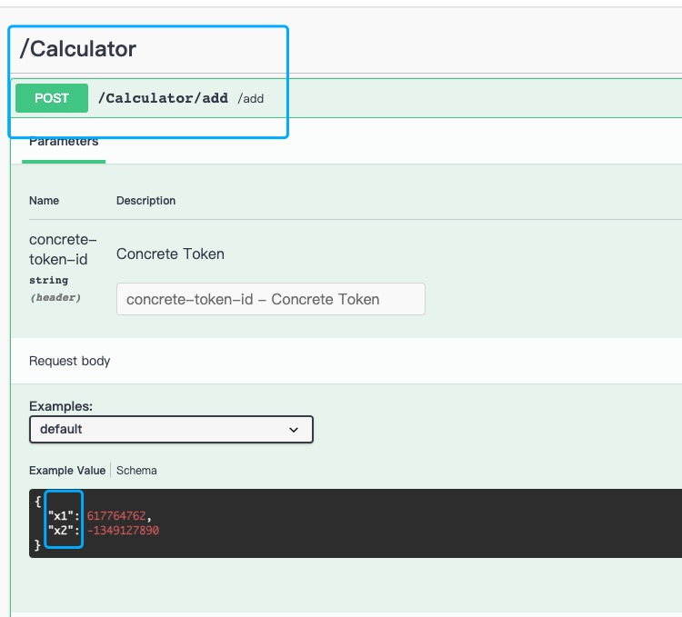
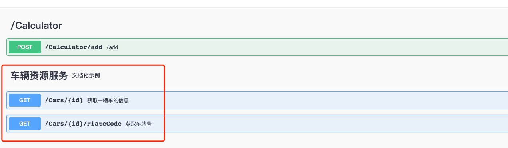

# 优化定义

在前一小节中，我们定义的AddService，发布路径、参数名映射都不是很友好，我们在AddService接口上进行优化

```java
package org.coodex.concrete.demo.api;

import org.coodex.concrete.api.ConcreteService;
import org.coodex.util.Parameter;

@ConcreteService("Calculator")//为服务模块指定服务名
public interface AddService {
    // 为参数指定名称
    int add(@Parameter("x1") int x1, @Parameter("x2") int x2);
}

```

跑起来看看。



我们可以看到，服务模块和参数名都有了改变

::: note
关于参数名，虽然Concrete支持java8的`--parameters`编译参数来获取方法参数名，但是依然不推荐这么做，对于需要明确的方法参数名，推荐使用@Parameter来声明
:::

## 使用mock

::: note
本节仅为了减少实现代码编写而引入mock，非必须
:::

前面的案例中，我们看到使用`concrete`开发的大概构成,`api`/`impl`/`boot`，为了加快示例，我们把`impl`先省掉，使用[`coodex-mock`](https://docs.coodex.org/lib/coodex-mock/)来提供服务。

为了减少代码量，我们在 root pom 里引入`lombok`

```xml
<dependencies>
    <dependency>
        <groupId>org.projectlombok</groupId>
        <artifactId>lombok</artifactId>
        <scope>provided</scope>
    </dependency>
</dependencies>
```

`demo-boot`中，把`concrete-jaxrs-swagger`的依赖调整到`test`作用域，并且增加`concrete-core-mock`

```xml
<dependency>
    <groupId>org.coodex.concrete.jaxrs</groupId>
    <artifactId>concrete-jaxrs-swagger</artifactId>
    <scope>test</scope>
</dependency>

<dependency>
    <groupId>org.coodex.concrete</groupId>
    <artifactId>concrete-core-mock</artifactId>
    <scope>test</scope>
</dependency>
```

::: tip concrete-core-mock
`concrete-core-mock`提供了基于`coodex-mock`的一个拦截器实现，开箱即用。
:::

然后在`demo-boot`的`test`代码空间里随便写个 class 来 run 之前的 application

```java
package org.coodex.concrete.demo.boot;

import org.springframework.boot.SpringApplication;

public class MockBoot {

    public static void main(String[] args) {
        SpringApplication.run(DemoBootStarter.class, args);
    }
}
```

跑起来，还是上一步的操作方式，我们使用`swagger`提交一个 x1=1,x2=1 的请求，看看结果，这时候不是 2 了，是一个随机数了，也就是说，`concrete-core-mock`代理掉了实现，或者说，不需要实现也可以进行前后端接口联调

::: note
`concrete-core-mock`主要目的是用来支撑前后端并行开发，前端、后端都遵循 api 的约定即可。
:::

既然我们已经有了`AddService`的实现，我们把它从 mock 拦截器中移除掉先。

在`demo-boot`的test作用域的resource目录下新增`mock.excepted`文件

```txt
org.coodex.concrete.demo.api.AddService
```

再跑起来，swagger，结果正确了。

::: tip mock.excepted
`mock.excepted`是`concrete-core-mock`的一个约定，只要在该文件中匹配命中的，不再使用mock来代理实现
:::

## 进一步优化

现在正式开始优化定义，我们新建一个服务

```java
package org.coodex.concrete.demo.api;

import org.coodex.concrete.api.ConcreteService;
import org.coodex.concrete.api.Description;
import org.coodex.concrete.demo.pojo.CarInfo;
import org.coodex.mock.Mock;
import org.coodex.mock.ext.VehicleNum;
import org.coodex.util.Parameter;

@ConcreteService("cars")
@Description(name = "车辆资源服务", description = "文档化示例")
public interface CarService {

    @ConcreteService("/{id}/PlateCode")
    @VehicleNum
    @Description(name = "获取车牌号", description = "根据一辆车的id获取它车牌号")
    String getCarNumberById(
            @Description(name = "车辆id")
            @Mock.String
            @Parameter("id")
            String id);

    @ConcreteService("/{id}")
    @Description(name = "获取一辆车的信息", description = "数据包括车牌号车牌颜色等")
    CarInfo getCarById(
            @Description(name = "车辆id")
            @Mock.String
            @Parameter("id")
            String id);
}
```

其中`CarInfo`的定义是

```java
package org.coodex.concrete.demo.pojo;

import lombok.Data;
import org.coodex.concrete.api.Description;
import org.coodex.mock.Mock;
import org.coodex.mock.ext.FullName;
import org.coodex.mock.ext.IdCard;
import org.coodex.mock.ext.VehicleNum;

@Data
public class CarInfo {
    @VehicleNum
    @Description(name = "车牌号码")
    private String plateCode;
    @Mock.Number("[0,4],9")
    @Description(name = "车牌颜色", description = "按照国标定义")
    private Integer plateColor;

    @Description(name = "车主姓名")
    @FullName
    private String ownerName;
    @Description(name = "车主身份证号")
    @IdCard
    private String idCard;

    @Description(name = "车辆品牌")
    @Mock.String(range = {"兰博基尼", "玛莎拉蒂", "奔驰", "宾利", "Audi", "BMW"})
    private String brand;
}
```

run



可以看到，红框中的部分和我们之前的风格不一样了，url 贴近 restful，服务说明也更清晰。

这个案例中，我们把 api 设计的三个部分进行了统一演示：api 命名，文档化，模拟数据。

### api 命名

`@ConcreteService`注解可以重命名服务或者模块，在 jaxrs 中，可以让你的 api 定义更贴合 restful 风格。

### 文档化

`@Description`可以对模块、服务、属性、参数进行文档化注解，把 api 设计和 api 文档合到一起。

### 模拟数据

定义模拟数据，让没有后端实现也可以进行接口联调。详细[参见](https://docs.coodex.org/lib/coodex-mock/)
