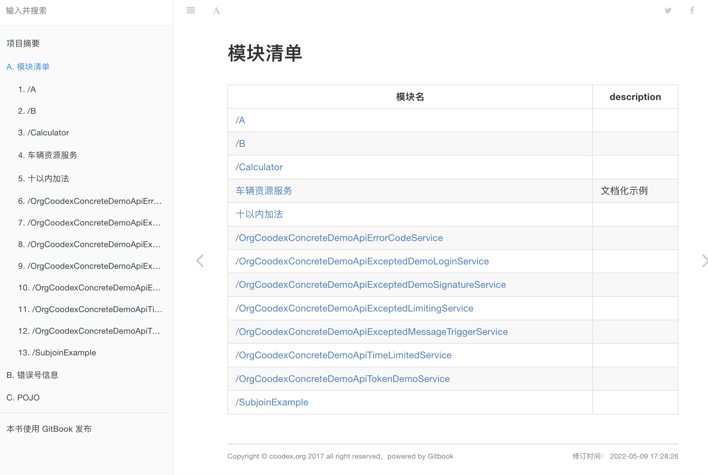
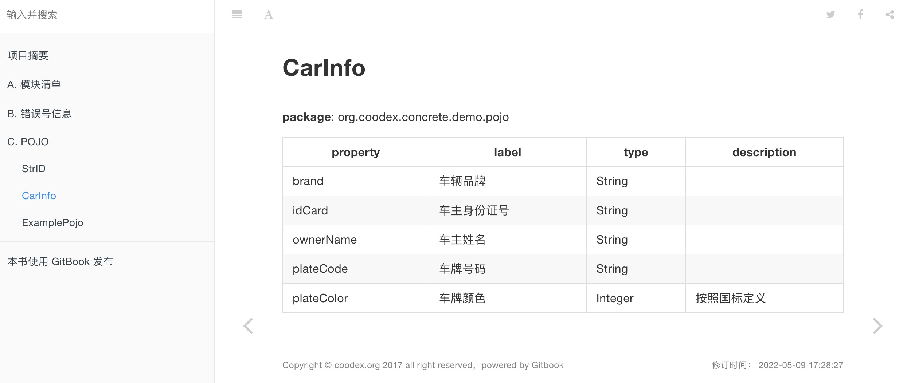
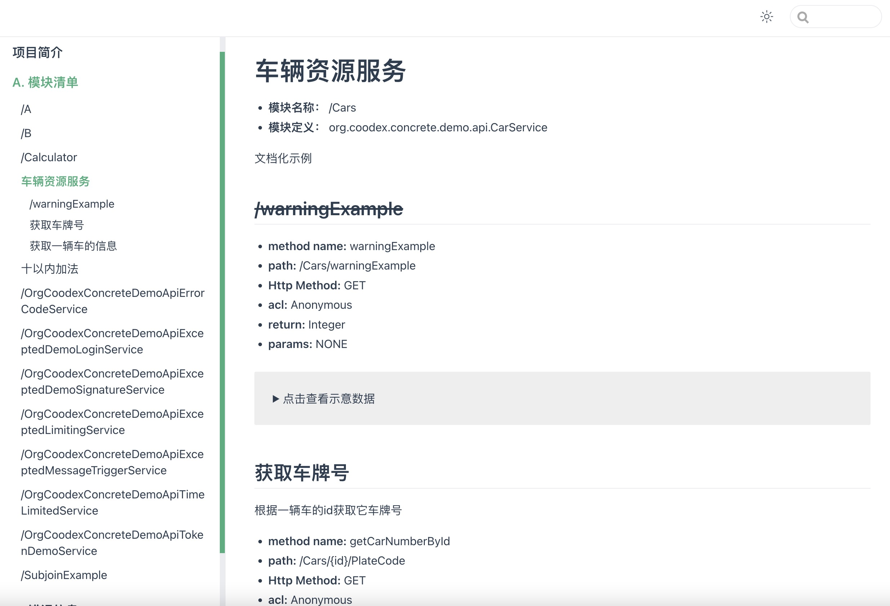

# 生成服务端文档

我们在前面的小节看到了使用swagger作为文档、调试一体化的工具，但是，swagger的阅读习惯可能不是那么符合一般人的阅读习惯，本节我们看看怎么使用`concrete`生成可发布的文档。

`demo-api` 增加依赖

```xml
<!-- 文档及脚本生成工具 -->
<dependency>
    <groupId>org.coodex.concrete</groupId>
    <artifactId>concrete-api-tools</artifactId>
    <scope>test</scope>
</dependency>

<!-- 让Profile支持yml，如果不加，使用.properties文件也是一样的 -->
<dependency>
    <groupId>org.yaml</groupId>
    <artifactId>snakeyaml</artifactId>
    <scope>test</scope>
</dependency>
```

test作用域中增加代码

```java
package org.coodex.concrete.demo.api;

import org.coodex.concrete.apitools.API;

import java.io.IOException;

public class DocGenerator {
    public static void main(String[] args) throws IOException {
        // 第一个参数说明使用哪个profile, api_gen.第一个参数
        API.generateFor("gitbook", "org.coodex.concrete.demo.**.api");
        API.generateFor("vuepress", "org.coodex.concrete.demo.**.api");
    }
}

```

`api_gen.gitbook.yml`

```yml
desc: JaxRS.doc.backend.gitbook.v1
path: demo-api/docs/gitbook
```

`api_gen.vuepress.yml`

```yml
desc: JaxRS.doc.backend.vuepress.v1
path: demo-api/docs/vuepress
```

`nodejs` / `gitbook-cli`的安装就不多说了，进入到gitbook文档的目录，`gitbook install && gitbook serve`，http://localhost:4000





进入vuepress文档的目录，`yarn && yarn serve`, http://localhost:4000/


