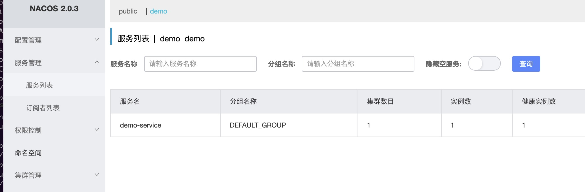

# Spring Cloud 支持

::: note
本节使用 nacos 作为注册中心，运行在 `localhost:8848`,命名空间为: `demo`
:::

在根 pom.xml 的`dependencyManagement`中，增加`spring-cloud-alibaba`的物料清单

```xml
<dependency>
    <groupId>com.alibaba.cloud</groupId>
    <artifactId>spring-cloud-alibaba-dependencies</artifactId>
    <version>2021.1</version>
    <type>pom</type>
    <scope>import</scope>
</dependency>
```

::: note 关于版本
目前 concrete 的 spring 依赖为：spring-boot 版本`2.4.13`,spring-cloud 版本`2020.0.4`，所以，spring-cloud-alibaba 应选用`2021.1`。版本关系[点我查看](https://github.com/alibaba/spring-cloud-alibaba/wiki/%E7%89%88%E6%9C%AC%E8%AF%B4%E6%98%8E)
:::

## 注册服务

在 demo-boot 中增加 spring-cloud-alibaba 的服务注册与发现依赖

```xml
<!-- spring-cloud-alibaba 服务自动注册与发现 -->
<dependency>
    <groupId>com.alibaba.cloud</groupId>
    <artifactId>spring-cloud-starter-alibaba-nacos-discovery</artifactId>
</dependency>
```

application.yml 中配置好注册中心地址

```yml
spring:
  application:
    name: demo-service
  cloud:
    nacos:
      discovery:
        server-addr: 127.0.0.1:8848
        namespace: demo # demo命名空间
management:
  endpoints:
    web:
      exposure:
        include: "*"
```

DemoBootStarter 增加`@EnableDiscoveryClient`注解，运行，这样，我们在 Nacos 的服务列表中，demo 命名空间，可以看到服务已经注册到 nacos 注册中心了.



## 调用服务

为了方便，我们单独建一个 demo-client-spring-cloud 模块来演示服务消费者。

依赖：

```xml
<!-- 服务发现 -->
<dependency>
    <groupId>com.alibaba.cloud</groupId>
    <artifactId>spring-cloud-starter-alibaba-nacos-discovery</artifactId>
</dependency>

<!-- 支持spring-cloud的concrete jaxrs client -->
<dependency>
    <groupId>org.coodex.concrete.jaxrs</groupId>
    <artifactId>concrete-jaxrs-client-spring-cloud</artifactId>
</dependency>

<!-- concrete spring支持模块 -->
<dependency>
    <groupId>org.coodex.concrete</groupId>
    <artifactId>concrete-core-spring</artifactId>
</dependency>

<dependency>
    <groupId>javax.inject</groupId>
    <artifactId>javax.inject</artifactId>
</dependency>

<!-- jaxrs 2 api -->
<dependency>
    <groupId>javax.ws.rs</groupId>
    <artifactId>javax.ws.rs-api</artifactId>
    <version>2.1-m05</version>
</dependency>

<dependency>
    <groupId>${project.parent.groupId}</groupId>
    <artifactId>demo-api</artifactId>
    <version>${project.parent.version}</version>
</dependency>
```

新建`org.coodex.concrete.demo.client.SpringCloudClientDemo`

```java
package org.coodex.concrete.demo.client;

import org.coodex.concrete.Client;
import org.coodex.concrete.ConcreteClient;
import org.coodex.concrete.client.spring.SpringJaxRSDestination;
import org.coodex.concrete.demo.api.SubjoinExampleService;
import org.coodex.concrete.spring.ConcreteSpringConfiguration;
import org.springframework.boot.SpringApplication;
import org.springframework.boot.autoconfigure.SpringBootApplication;
import org.springframework.cloud.client.discovery.EnableDiscoveryClient;
import org.springframework.context.ApplicationContext;
import org.springframework.context.annotation.Import;

import javax.inject.Inject;

@EnableDiscoveryClient // 自动发现
@SpringBootApplication
@Import(ConcreteSpringConfiguration.class) //引入concrete-spring支持
public class SpringCloudClientDemo {

    // 注入方式，需要在Config中配置此模块的信息
    @Inject
    @ConcreteClient("spring-cloud-client-demo")
    private SubjoinExampleService subjoinExampleService;


    public static void main(String[] args) {
        ApplicationContext context = SpringApplication.run(SpringCloudClientDemo.class, args);

        // DI demo
        SpringCloudClientDemo demo = context.getBean(SpringCloudClientDemo.class);
        System.out.println(demo.subjoinExampleService.add(11, 22));

        // Destination 模式
        SpringJaxRSDestination destination = new SpringJaxRSDestination();
        destination.setMicroService(true);
        destination.setLocation("http://demo-service/jaxrs"); //使用服务名调用
        SubjoinExampleService exampleService = Client.getInstance(SubjoinExampleService.class, destination);
        System.out.println(exampleService.add(1, 2));
    }
}
```

spring-boot配置`application.yml`

```yml
spring:
  cloud:
    nacos:
      discovery:
        server-addr: 127.0.0.1:8848
        namespace: demo # demo命名空间
concrete:
  jaxrs:
    logger:
      level:
        client: INFO
  client:
    spring-cloud-client-demo: # demoModule声明
      destination: http://demo-service/jaxrs
      microService: true # 使用微服务的方式调用

```

关于依赖、代码、配置的说明都在注释里了，这样，我们运行起来：

```txt
2022-05-07 15:08:14.520  INFO 40850 --- [           main] o.c.c.client.spring.LoggingInterceptor   : request: 
1 > POST http://demo-service/jaxrs/SubjoinExample/add
1 > Accept: application/octet-stream, application/json, application/*+json, */*
1 > Accept-Language: zh-CN
1 > Accept-Encoding: gzip
1 > X-CLIENT-PROVIDER: concrete-client-spring-web 0.5.1-RC2
1 > Content-Type: application/json
1 > Content-Length: 17
{"x1":11,"x2":22}

2022-05-07 15:08:15.679  INFO 40850 --- [           main] o.c.c.client.spring.LoggingInterceptor   : response: 
1 < 200 
1 < Content-Length: 2
1 < Concrete-Warnings: %5B%7B%22code%22%3A105001%2C%22message%22%3A%2211+%2B+22+%E5%A4%AA%E9%9A%BE%E4%BA%86+%7E%3E_%3C%7E%22%7D%5D
1 < Connection: keep-alive
1 < Content-Type: application/json;charset=UTF-8
1 < Date: Sat, 07 May 2022 07:08:15 GMT
1 < Keep-Alive: timeout=4
1 < Proxy-Connection: keep-alive
33

2022-05-07 15:08:15.725  WARN 40850 --- [           main] o.c.c.client.WarningClientInterceptor    : no warning handler found, but warning occurred.
33
2022-05-07 15:08:15.733  INFO 40850 --- [           main] o.c.c.client.spring.LoggingInterceptor   : request: 
2 > POST http://demo-service/jaxrs/SubjoinExample/add
2 > Accept: application/octet-stream, application/json, application/*+json, */*
2 > Accept-Language: zh-CN
2 > Accept-Encoding: gzip
2 > X-CLIENT-PROVIDER: concrete-client-spring-web 0.5.1-RC2
2 > Content-Type: application/json
2 > Content-Length: 15
{"x1":1,"x2":2}

2022-05-07 15:08:15.777  INFO 40850 --- [           main] o.c.c.client.spring.LoggingInterceptor   : response: 
2 < 200 
2 < Content-Length: 1
2 < Connection: keep-alive
2 < Content-Type: application/json;charset=UTF-8
2 < Date: Sat, 07 May 2022 07:08:15 GMT
2 < Keep-Alive: timeout=4
2 < Proxy-Connection: keep-alive
3

3
```
