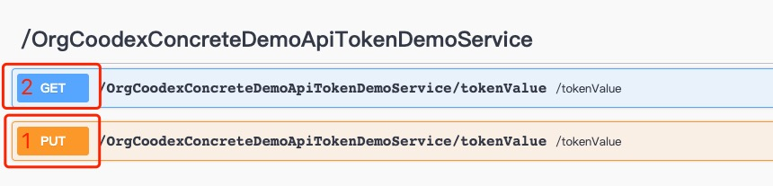

# 令牌

concrete service 本质上讲也是无状态的，所以，设计了令牌用来与客户端维持状态。和 servlet 的 session 相似，不同的是，concrete 抽象了 token，不限定服务提供方式，也就是面向业务代码统一了 api。下面，我们来体验以下令牌的使用。

新建 TokenDemoService，写实现，boot 里例外掉，这些操作应该都熟悉了吧，不再一端端的贴了。

- 服务定义

```java
package org.coodex.concrete.demo.api;

import org.coodex.concrete.api.ConcreteService;
import org.coodex.util.Parameter;

@ConcreteService
public interface TokenDemoService {
    /**
     * @param value 往token里设置一个值
     */
    void setTokenValue(@Parameter("value") String value);

    /**
     * @return 获取token中的值
     */
    String getTokenValue();
}
```

- 服务实现

```java
package org.coodex.concrete.demo.impl;

import org.coodex.concrete.common.Token;
import org.coodex.concrete.demo.api.TokenDemoService;

import javax.inject.Inject;
import javax.inject.Named;

@Named
public class TokenDemoServiceImpl implements TokenDemoService {
    private final static String TOKEN_KEY = "DEMO_KEY";

    @Inject // <-- 注入token
    private Token token;

    @Override
    public void setTokenValue(String value) {
        token.setAttribute(TOKEN_KEY, value);
    }

    @Override
    public String getTokenValue() {
        return token.getAttribute(TOKEN_KEY, String.class);
    }
}
```

我们可以在 swagger 中可以看到以下两个接口



先 PUT，再 GET 看看。注意，在每个接口的 Parameter 中，都有一个 header parameter: concrete-token-id，在 concrete-jaxrs 服务提供方式中，就是通过它来传递令牌号的，所以，在调用 GET 方法之前，你需要把 PUT 方法返回 header 中的 concrete-token-id 值填到这个输入框里，用以声明这两次调用是一个会话状态。

::: note
使用 concrete-client/ concrete-api-tools 生成的脚本会自动管理 token，不需要额外的操作。
:::

- 使用 concrete-client 调用

```java
package org.coodex.concrete.demo.client;

import lombok.extern.slf4j.Slf4j;
import org.coodex.concrete.Client;
import org.coodex.concrete.demo.api.TokenDemoService;

@Slf4j
public class TokenDemoClient {
    public static void main(String[] args) {
        TokenDemoService tokenDemoService = Client.getInstance(TokenDemoService.class, "demoModule");
        tokenDemoService.getTokenValue();
        tokenDemoService.setTokenValue("你好");
        log.info("getTokenValue: {}", tokenDemoService.getTokenValue());
    }
}
```

客户端执行结果：

```txt
2022-05-03 18:14:10 [main] INFO  org.coodex.concrete.jaxrs.logging.ClientLogger - 1 * Sending client request on thread main
1 > GET http://localhost:8080/jaxrs/OrgCoodexConcreteDemoApiTokenDemoService/tokenValue
1 > Accept-Encoding: gzip
1 > Accept-Language: zh-CN
1 > X-CLIENT-PROVIDER: concrete-client-jaxrs 0.5.1-RC2

2022-05-03 18:14:11 [main] INFO  org.coodex.concrete.jaxrs.logging.ClientLogger - 1 * Client response received on thread main
1 < 204
1 < Connection: keep-alive
1 < Date: Tue, 03 May 2022 10:14:11 GMT
1 < Keep-Alive: timeout=60

2022-05-03 18:14:11 [main] INFO  org.coodex.concrete.jaxrs.logging.ClientLogger - 2 * Sending client request on thread main
2 > PUT http://localhost:8080/jaxrs/OrgCoodexConcreteDemoApiTokenDemoService/tokenValue
2 > Accept-Encoding: gzip
2 > Accept-Language: zh-CN
2 > Content-Type: application/json;charset=UTF-8
2 > X-CLIENT-PROVIDER: concrete-client-jaxrs 0.5.1-RC2
{"value":"你好"}

2022-05-03 18:14:11 [main] INFO  org.coodex.concrete.jaxrs.logging.ClientLogger - 2 * Client response received on thread main
2 < 204
2 < CONCRETE-TOKEN-ID: iewHih35uy
2 < Connection: keep-alive
2 < Date: Tue, 03 May 2022 10:14:11 GMT
2 < Keep-Alive: timeout=60

2022-05-03 18:14:11 [main] INFO  org.coodex.concrete.jaxrs.logging.ClientLogger - 3 * Sending client request on thread main
3 > GET http://localhost:8080/jaxrs/OrgCoodexConcreteDemoApiTokenDemoService/tokenValue
3 > Accept-Encoding: gzip
3 > Accept-Language: zh-CN
3 > CONCRETE-TOKEN-ID: iewHih35uy
3 > X-CLIENT-PROVIDER: concrete-client-jaxrs 0.5.1-RC2

2022-05-03 18:14:11 [main] INFO  org.coodex.concrete.jaxrs.logging.ClientLogger - 3 * Client response received on thread main
3 < 200
3 < Connection: keep-alive
3 < Content-Length: 6
3 < Content-Type: text/plain;charset=UTF-8
3 < Date: Tue, 03 May 2022 10:14:11 GMT
3 < Keep-Alive: timeout=60
你好

2022-05-03 18:14:11 [main] INFO  org.coodex.concrete.demo.client.TokenDemoClient - getTokenValue: 你好
```

我们看到，第一次请求 tokenValue 的时候，返回 204，也就是 no content，对于 java client 实际上就是 null，第二次请求是设置 tokenValue,这时候响应里返回了一个`CONCRETE-TOKEN-ID: iewHih35uy`，这个就是令牌的 id，这个令牌就是维护与客户端之前状态用的，第三次请求，带着上一个令牌，再去取 tokenValue，结果取到了设置的值，达到预期。

令牌的持久化是可扩展的，我们实例中的令牌是在内存中，concrete-core 还提供了一个`org.coodex.concrete.core.token.sharedcache.SharedCacheTokenManager`使用`redis`或`memcached`管理令牌，为集群应用提供支持。当然，开发者也可以自行实现`org.coodex.concrete.core.token.TokenManager`来进行扩展。
