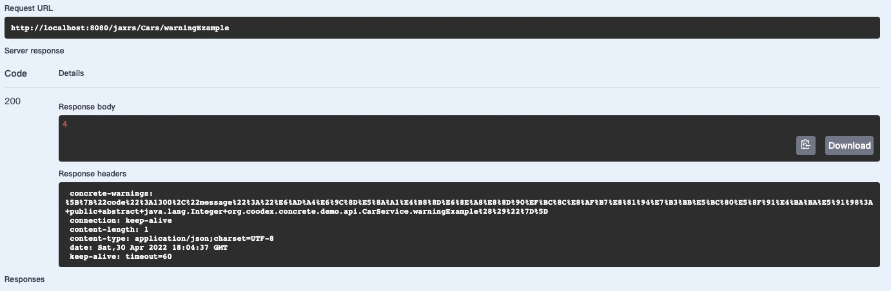

# Warning

上一小节我们看到了服务的两种处理情况，正常和异常，在实际场景中，可能会存在第三种情况，处理是正常，但是会有一些警告，比如，服务即将到期等。`concrete`通过在`Subjoin`中放置 Warning 信息来达到。

我们先看一个简单示例，CarService(没有写实现的那个)中，增加一个方法 warningExample.

```java
    @Deprecated
    @Mock.Number("[3,9]")
    Integer warningExample();
```

这个服务在我们目前的项目中，还是使用 mock 来执行的，所以我们不用去写实现，直接 run

在 swagger 中 try 一下，结果如下：



我们可以看到，http 响应码是成功(200)，Response body 也是预期中的[3,9]之一，但是 Response headers 里有个 concrete-warnings 的 header，一大串，这个就是 warning 信息了，是什么呢？我们做一下 URLdecoder(原因：http header 中不能使用非 ascii 字符，所以 warning 数据在 concrete-jaxrs 传递的时候，进行了 urlEncoder)

传递的内容：

```txt
%5B%7B%22code%22%3A1300%2C%22message%22%3A%22%E6%AD%A4%E6%9C%8D%E5%8A%A1%E4%B8%8D%E6%8E%A8%E8%8D%90%EF%BC%8C%E8%AF%B7%E8%81%94%E7%B3%BB%E5%BC%80%E5%8F%91%E4%BA%BA%E5%91%98%3A+public+abstract+java.lang.Integer+org.coodex.concrete.demo.api.CarService.warningExample%28%29%22%7D%5D
```

解码后

```json
[
  {
    "code": 1300,
    "message": "此服务不推荐，请联系开发人员: public abstract java.lang.Integer org.coodex.concrete.demo.api.CarService.warningExample()"
  }
]
```

这样就明白了，实际上 warning 数据是个 json，每个 warning 包含 code 和 message，这两个和上一节提到的 ErrorCodes 是一样的

<!-- 本节先说明concrete有warning机制，并且自动支持`java.lang.Deprecated`注解，在下一节[Subjoin](05.subjoin.md)中再看看怎么由开发者设置需要传递的warning信息。 -->
